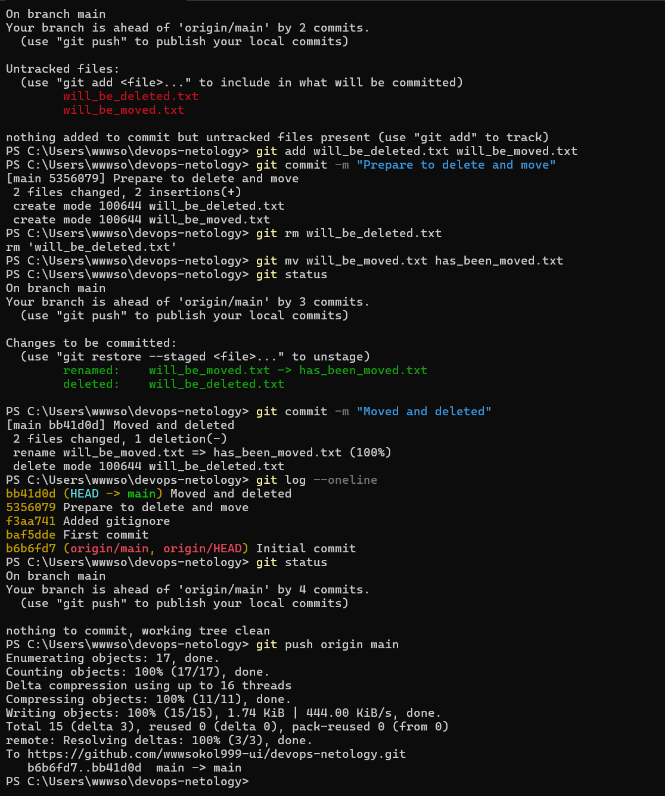
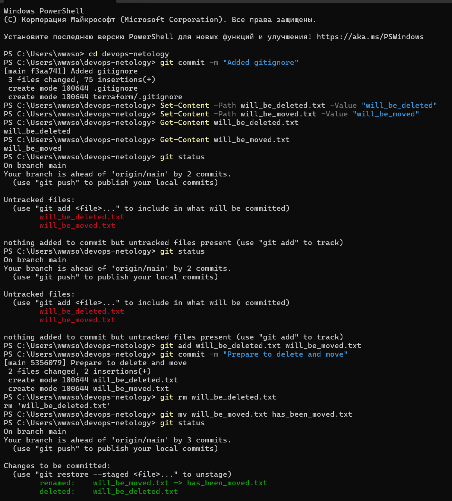

# \# devops-netology

# 

# Репозиторий для выполнения домашних заданий по курсу DevOps.

# 

# \## Игнорируемые файлы

# 

# Корневой файл `.gitignore` исключает из репозитория:

# 

# \- настройки IDE `.idea` и `.vscode`;

# \- системные файлы Windows и macOS;

# \- временные файлы и журналы с расширениями `.tmp` и `.log`.

# 

# Файл `terraform/.gitignore` исключает:

# 

# \- каталог `.terraform`;

# \- файлы состояния Terraform `\*.tfstate`;

# \- файлы переменных `\*.tfvars`;

# \- файлы с логами аварий;

# \- локальные файлы переопределения;

# \- файлы планов Terraform.

