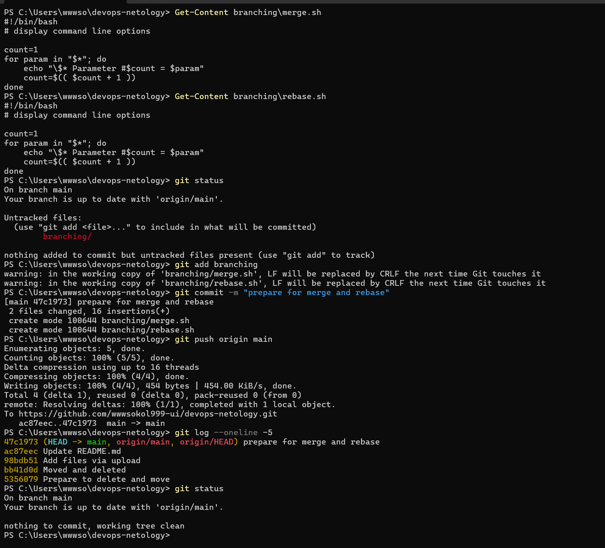
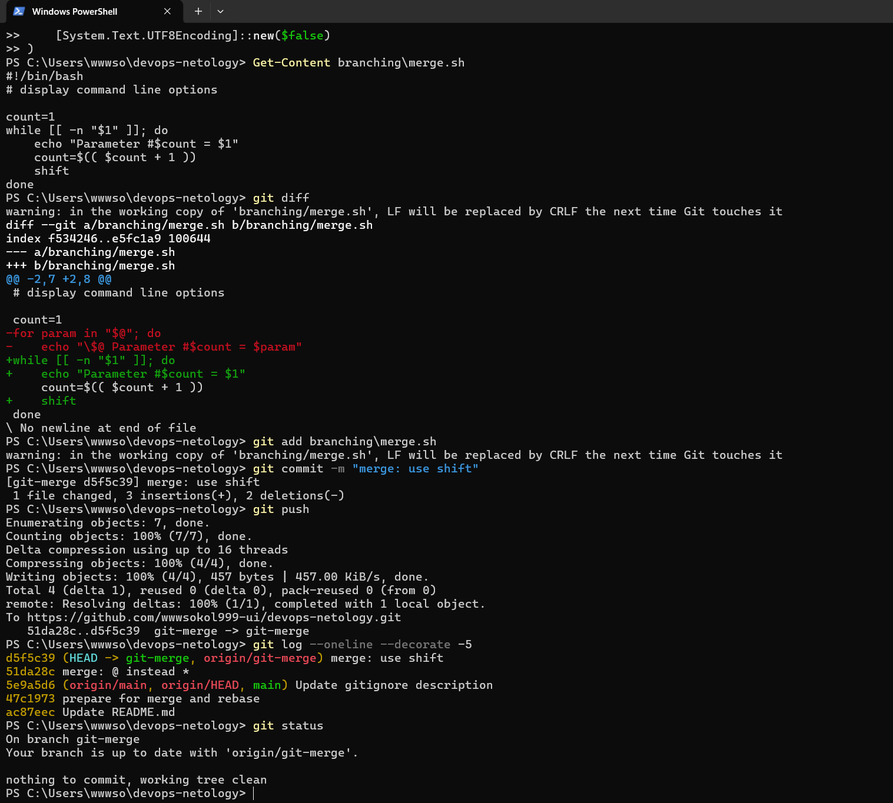
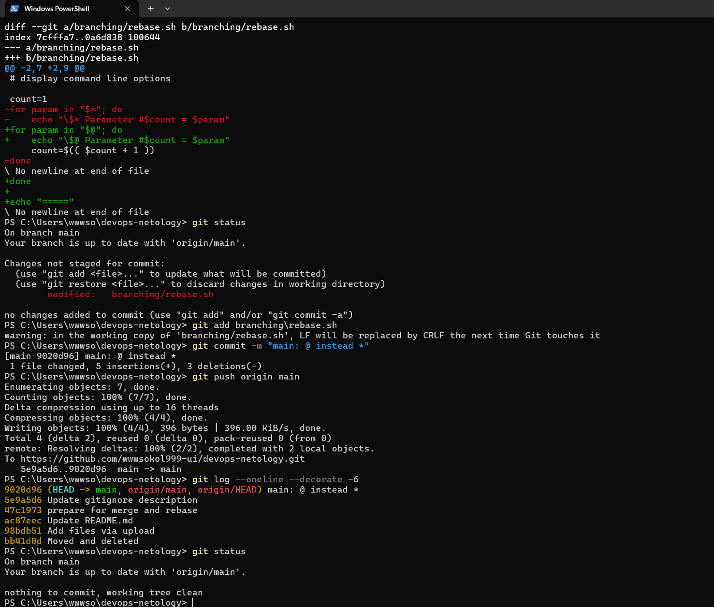
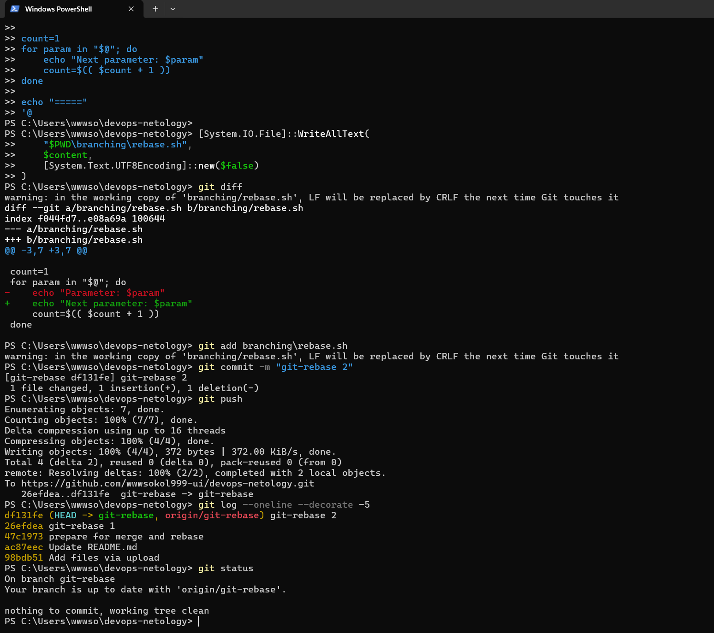
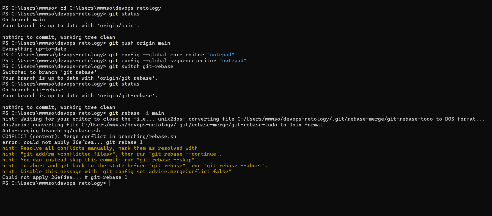
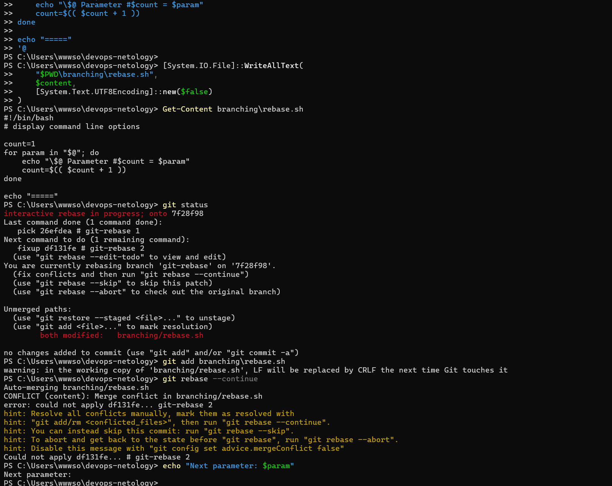
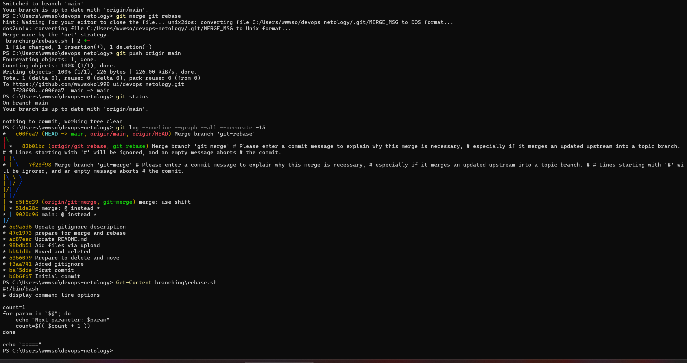
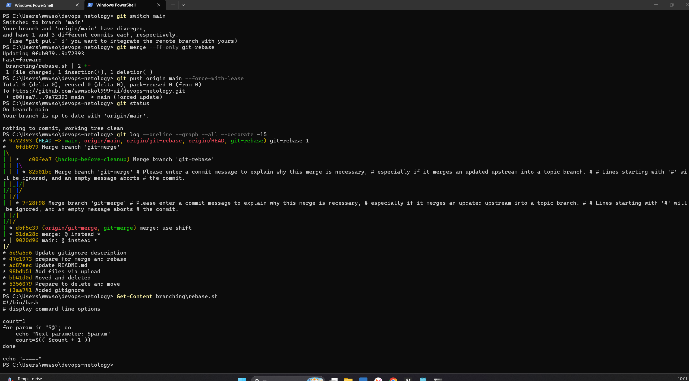
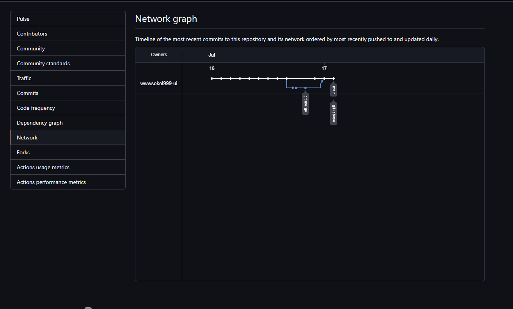

# Домашнее задание «Ветвление, merge и rebase»

## Подготовка

В каталоге `branching` созданы файлы:

- `merge.sh`
- `rebase.sh`

Первоначальные файлы сохранены коммитом:

```text
prepare for merge and rebase
```

## Работа с merge

Создана ветка `git-merge`.

В ней выполнены два коммита:

```text
merge: @ instead *
merge: use shift
```

После этого ветка `git-merge` была объединена с веткой `main` при помощи команды:

```bash
git merge git-merge
```

## Работа с rebase

Ветка `git-rebase` была создана от коммита:

```text
prepare for merge and rebase
```

В ней выполнены два коммита:

```text
git-rebase 1
git-rebase 2
```

Затем выполнен интерактивный rebase:

```bash
git rebase -i main
```

Второй коммит был объединён с первым при помощи `fixup`.

Во время выполнения rebase были разрешены конфликты в файле `branching/rebase.sh`.

Итоговая строка скрипта:

```bash
echo "Next parameter: $param"
```

После изменения истории ветка была отправлена в GitHub командой:

```bash
git push origin git-rebase --force-with-lease
```

В конце ветка `git-rebase` была объединена с `main`.

## Результат

В ходе выполнения задания были отработаны:

- создание веток;
- выполнение merge;
- интерактивный rebase;
- объединение коммитов через `fixup`;
- разрешение конфликтов;
- принудительное обновление удалённой ветки;
- просмотр графа веток и коммитов.

## Скриншоты выполнения

### Подготовка файлов



### Создание ветки git-merge



### Коммиты в ветке git-merge



### Изменение ветки main



### Создание ветки git-rebase



### Первый конфликт rebase



### Второй конфликт rebase



### Завершение rebase



### Итоговая история коммитов



## Ссылки

- [Network-граф репозитория](https://github.com/wwwsokol999-ui/devops-netology/network)
- [Репозиторий](https://github.com/wwwsokol999-ui/devops-netology)
