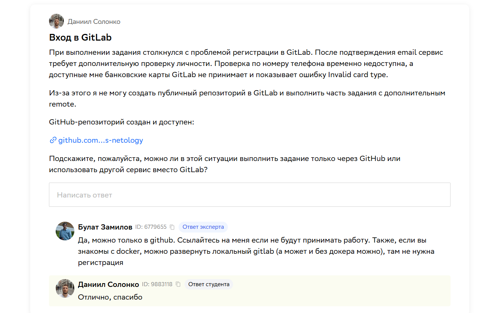
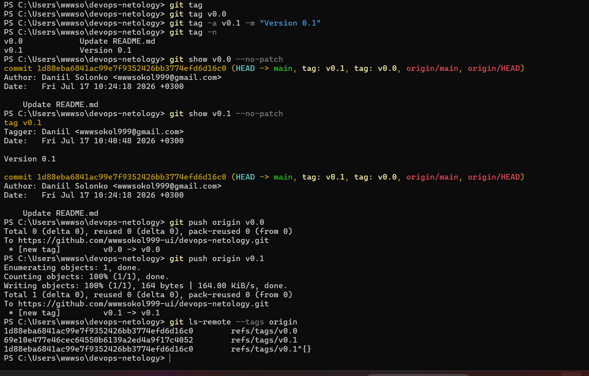
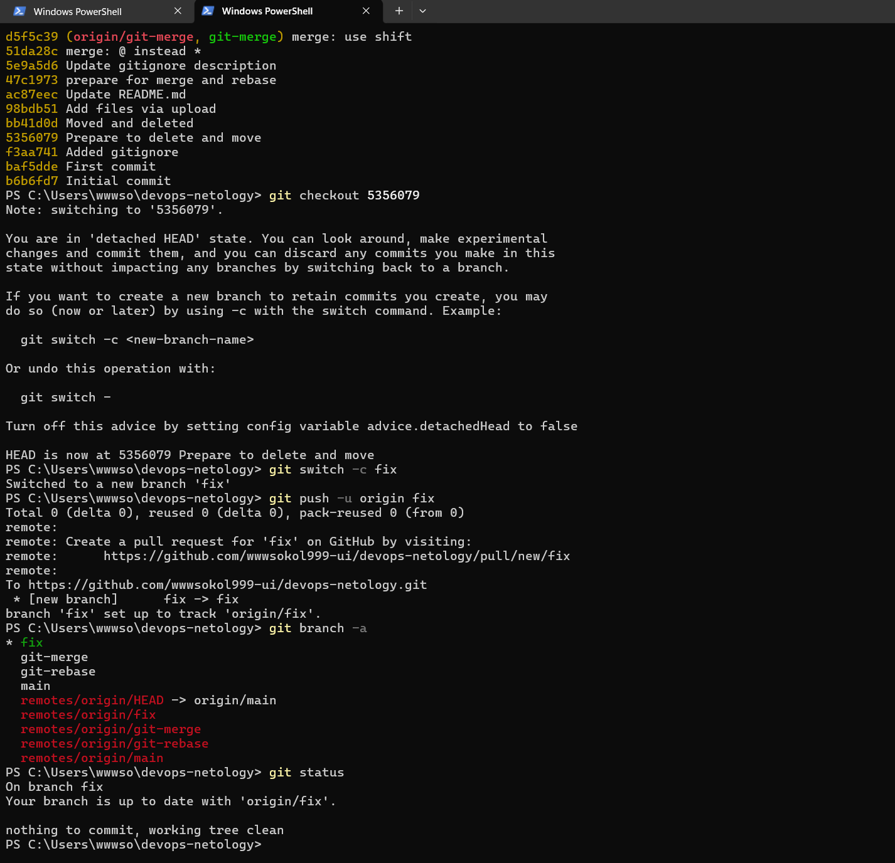
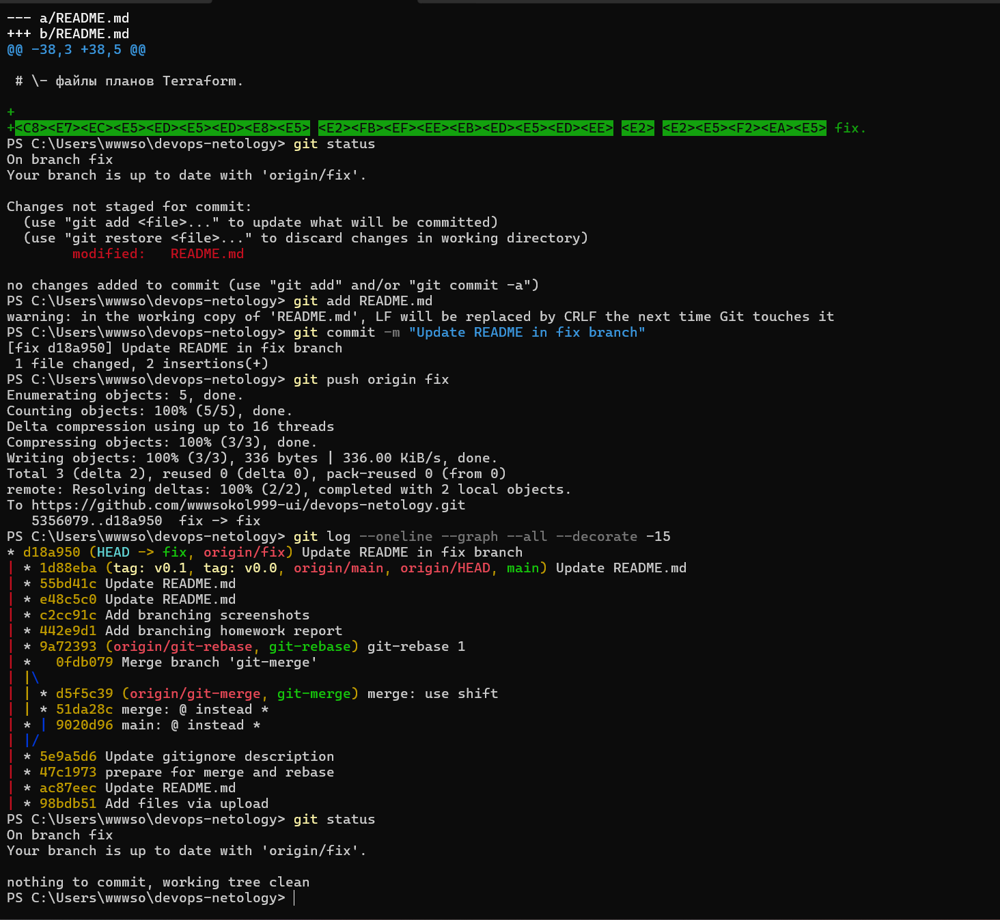
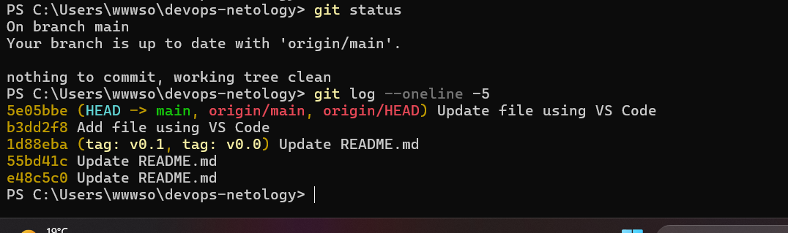
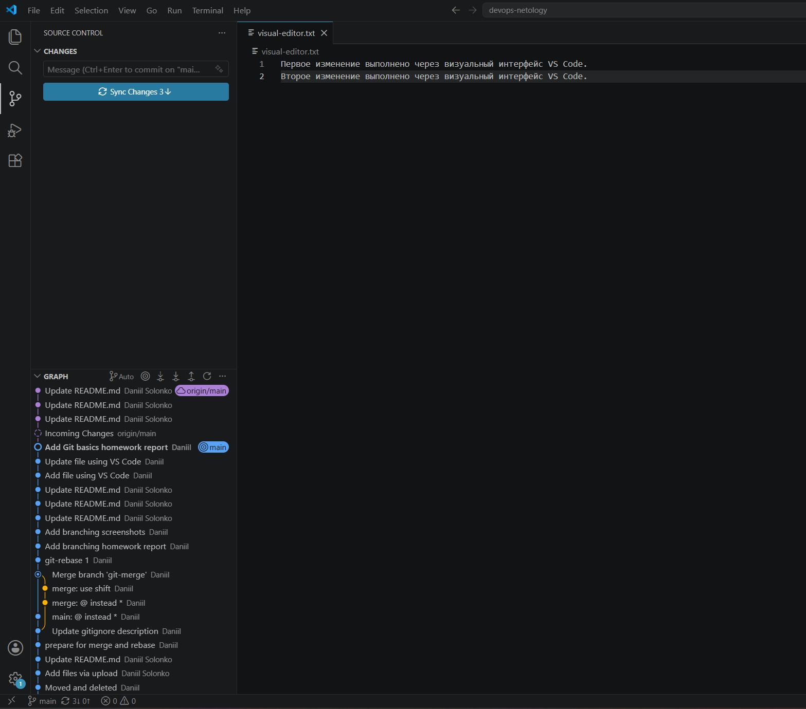

# Домашнее задание «Основы Git»


## Задание 1. Удалённые репозитории


Задание выполнено только через GitHub по согласованию с преподавателем.


Регистрация в GitLab была недоступна из-за обязательной проверки банковской карты. Bitbucket является заданием со звёздочкой и не выполнялся.


GitHub-репозиторий:


https://github.com/wwwsokol999-ui/devops-netology


## Задание 2. Теги


Создан легковесный тег:


```bash

git tag v0.0

```


Создан аннотированный тег:


```bash

git tag -a v0.1 -m "Version 0.1"

```


Теги отправлены в GitHub:


```bash

git push origin v0.0

git push origin v0.1

```

Список тегов:

https://github.com/wwwsokol999-ui/devops-netology/tags

## Задание 3. Ветки


Ветка `fix` создана от коммита:

```text

5356079 Prepare to delete and move

```

Использованные команды:

```bash

git checkout 5356079

git switch -c fix

git push -u origin fix

```

В файл `README.md` добавлена новая строка, после чего изменение было сохранено отдельным коммитом и отправлено в GitHub.


Network graph:

https://github.com/wwwsokol999-ui/devops-netology/network

## Задание 4. Работа через VS Code

Через визуальный интерфейс VS Code были созданы два коммита:

```text

Add file using VS Code

Update file using VS Code

```

Был создан и изменён файл:

```text

visual-editor.txt

```

## Результат


В ходе выполнения задания были отработаны:


- создание легковесного и аннотированного тегов;

- отправка тегов в удалённый репозиторий;

- создание ветки от старого коммита;

- отправка отдельной ветки в GitHub;

- просмотр Network graph;

- создание коммитов через визуальный интерфейс VS Code.









